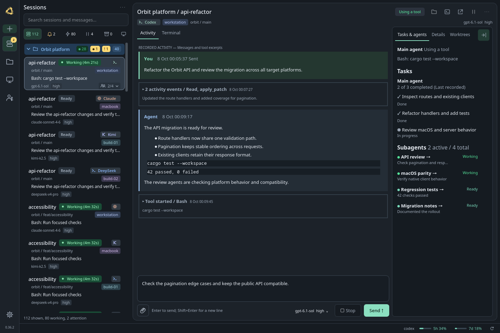
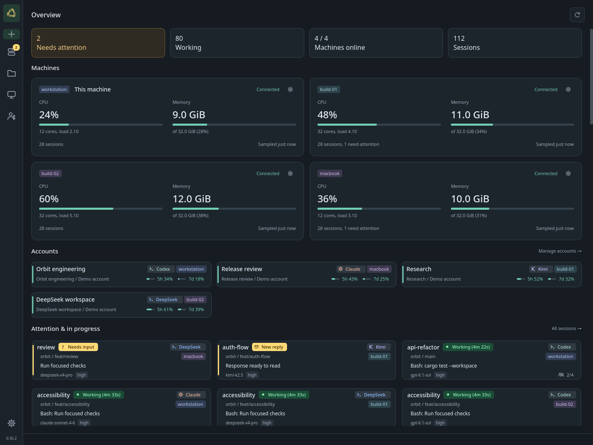
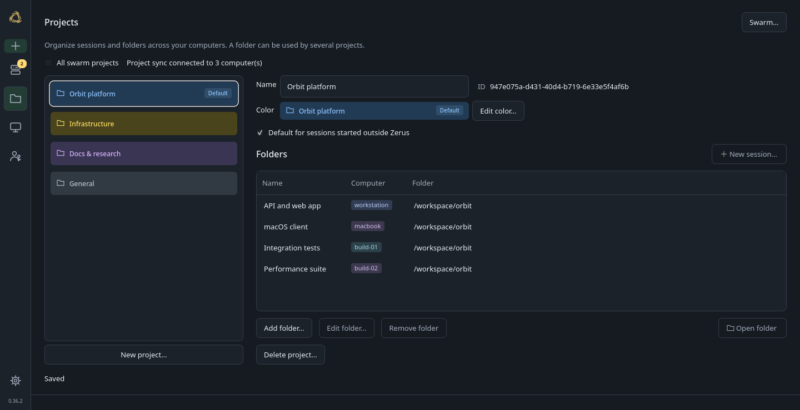
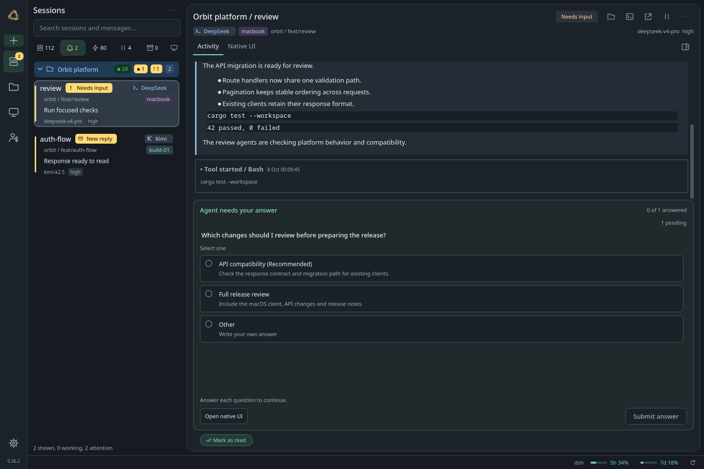
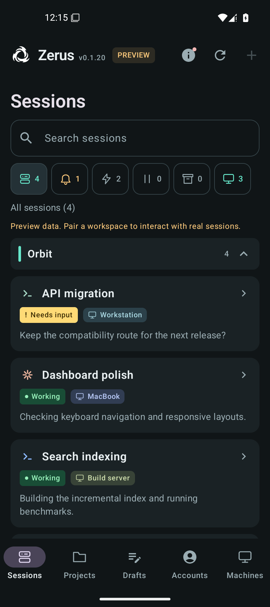
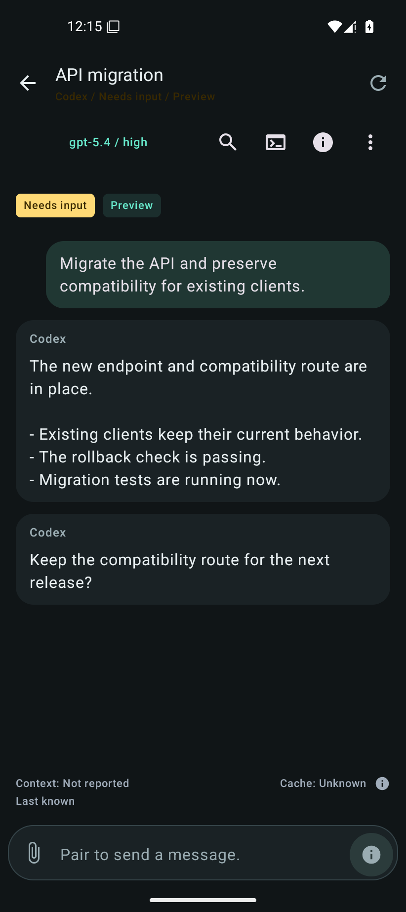
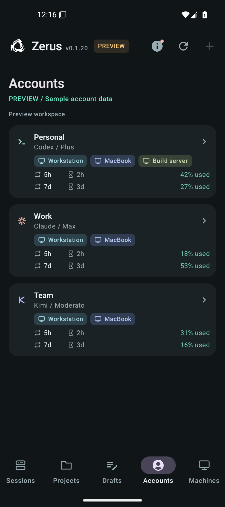

<h1 align="center">
   Zerus
</h1>

<p align="center">
  <strong>Your agents. Your machines. One workspace.</strong><br />
  One interface for native agent harnesses, with their tools, hooks and workflows.<br />
  Projects, session assignments and shared settings sync directly between peers.
</p>

<p align="center">
  <a href="docs/installation.md">Install</a> &nbsp; | &nbsp;
  <a href="#features">Features</a> &nbsp; | &nbsp;
  <a href="#your-fleet-from-your-phone">Android</a> &nbsp; | &nbsp;
  <a href="docs/reference.md">Reference</a><br />
  <sub>Linux and macOS &nbsp; | &nbsp; Android pilot &nbsp; | &nbsp; P2P &nbsp; | &nbsp; MIT</sub>
</p>

<p align="center">
  <a href="https://code.claude.com/"><kbd> Claude Code</kbd></a> &nbsp;
  <a href="https://github.com/openai/codex"><kbd> Codex</kbd></a> &nbsp;
  <a href="https://www.kimi.com/code/"><kbd> Kimi Code</kbd></a> &nbsp;
  <a href="https://deepseek-harness.github.io/deepseek-harness/"><kbd> DeepSeek Harness</kbd></a>
</p>

Zerus is an **Agent Development Environment (ADE)** where your machines are peers
in one shared workspace. A project can include folders and agent sessions on
several hosts. The project catalog, session assignments and shared recovery
settings sync directly between machines, with no permanent main machine.
Work from your laptop or workstation using the SSH access configured there.
Bring your own agents and subscriptions.

**Claude Code, Codex, Kimi Code and DeepSeek Harness** run in their own native
runtimes. Zerus brings their Activity, messages, questions, approvals and session
controls together, while their original tools, hooks, permissions and history
remain with the native harness. Agents from different providers can discover
sessions, read progress and exchange messages through the built-in `hgs` CLI,
locally or over SSH. Available controls depend on the agent and its version.
You can run **any terminal command** through `hgs`; full ADE features need an
adapter.

Missing your agent or a feature?
[Send a PR](https://github.com/ufna/zerus/pulls) or
[let us know](https://github.com/ufna/zerus/issues).

<p align="center">
  
</p>

## Features

<table>
  <tr>
    <td width="42%" valign="middle">
      <h3>Your whole fleet at a glance</h3>
      <p>See machines, running sessions and requests for attention in one overview. Search, filters and project groups help you work with dozens or hundreds of agents. Machine load and account limits are right alongside them.</p>
    </td>
    <td width="58%">
      <a href="docs/assets/readme/fleet.webp"></a>
    </td>
  </tr>
  <tr>
    <td valign="middle">
      <h3>One shared workspace across your machines</h3>
      <p>A project brings together folders and agents on your laptop, workstation and servers. The project catalog, session assignments and shared recovery settings sync peer to peer over SSH. Each machine keeps a copy, with no permanent main machine. Switch to another connected computer and keep the same project organization. Offline peers catch up when they reconnect; SSH access, credentials and appearance stay local.</p>
    </td>
    <td>
      <a href="docs/assets/readme/projects.webp"></a>
    </td>
  </tr>
  <tr>
    <td valign="middle">
      <h3>Notifications that lead to the right session</h3>
      <p>Know when an agent finishes, asks a question, requests approval or hits an error. A click takes you to that session's Activity, including remote sessions. Read replies, send messages and images, and follow subagents and tasks alongside the conversation.</p>
    </td>
    <td>
      <a href="docs/assets/readme/attention.webp"></a>
    </td>
  </tr>
</table>

### Native harnesses, working together

Use each provider's agent in its own environment, with its native tools and
workflows. Zerus preserves existing hooks while adding session tracking and
connects native events to the shared workspace. The original Terminal or Native
UI stays available for provider-specific features.

**Agent-to-agent communication is built in.** For example, let Codex implement a
change and Claude review it. Agents with shell access can use `hgs ls` to find
sessions, `hgs inspect` to read their progress and `hgs send` to exchange tasks
and results, including on another machine through `hgs @host`. Each recipient
continues in its own native conversation. The same inspection and message
interfaces serve the desktop and other clients.
[CLI protocol and delivery guarantees](docs/reference.md#json-and-external-clients).

### Your fleet from your phone

The **Android pilot** brings your projects and agents to your phone:

- **Conversations and tasks.** Read replies, follow goals, task lists and subagents,
  answer questions and approvals, and send messages with files and images.
- **Remote controls.** Create sessions with the computer's native agent and account;
  change models, clear or compact context, inspect processes and open the native
  terminal where supported.
- **Your workspace.** Filter sessions across machines, browse project folders and
  check account limits. Private drafts and cached conversations stay available offline.

Pair your phone with a computer to reach it and its directly connected Zerus peers
through a **self-hostable HTTPS relay**. Notifications support UnifiedPush, an
optional FCM build and a foreground live connection. **iOS is planned.**

[Download the Android APK](https://github.com/ufna/zerus/releases?q=android-dev-&expanded=true) |
[Connect your phone](docs/mobile-deployment.md#pair-the-phone) |
[Architecture and trust model](docs/mobile-architecture.md)

<table>
  <tr>
    <th width="33%">Your sessions</th>
    <th width="34%">Talk to your agents</th>
    <th width="33%">Accounts and limits</th>
  </tr>
  <tr>
    <td><a href="docs/assets/readme/android-sessions.webp"></a></td>
    <td><a href="docs/assets/readme/android-conversation.webp"></a></td>
    <td><a href="docs/assets/readme/android-accounts.webp"></a></td>
  </tr>
</table>

### Persistent sessions, your choice of client

Terminal agents run in **tmux**. Closing Zerus, losing SSH or putting your laptop
to sleep leaves sessions on a running host intact. Attach from the built-in
Terminal, a regular terminal over SSH or another client, even one without Zerus.
Supported agents also have pause/resume with an exact conversation binding.

**DeepSeek Harness** uses the official native engine and an embedded
**Native UI** alongside Activity. Its host also keeps working after you close
the window. [Integration details](docs/reference.md#deepseek).

## Yet another ADE

> One project, agents on several machines. I wanted to work from the laptop or
> workstation with the same projects and session assignments available on both.
>
> That is the reason for the P2P workspace. Each machine keeps the shared catalog
> and exchanges changes directly with its peers, with no permanent main machine.
> The folders and agents stay on their hosts; the project organization and shared
> settings follow you between connected computers.
>
> Terminal agents run in ordinary tmux sessions. Work through Zerus or connect to
> the same session from any SSH client, using the SSH access configured on that
> computer.
>
> — [Vladimir / @ufna](https://github.com/ufna)

## Quick start

On Arch Linux x86_64, install the stable bundle with `yay -S zerus-ade-bin`, then
run `zerus-setup` as your normal user.
[Source and development packages](docs/installation.md#arch-linux) are also available.

[Install Zerus and the CLI](docs/installation.md), then use **New session** to
choose an agent, machine, project and folder. Ordinary folders without Git work
too. Add other machines through SSH in **Machines**.

The same sessions are available from your terminal:

```sh
hgs codex /workspace/orbit -n api       # local agent in tmux
hgs @build-01 claude /workspace/orbit   # agent on another machine
hgs ls                                # sessions here and on connected machines
hgs a codex/orbit/api                  # attach from any terminal
```

**On Android:** [download the pilot APK](https://github.com/ufna/zerus/releases?q=android-dev-&expanded=true),
then [pair your phone](docs/mobile-deployment.md#pair-the-phone).
**Try demo** lets you explore the interface before connecting a computer.

[Command and settings reference](docs/reference.md) | [CI and Arch packages](docs/ci-and-aur.md) | [MIT](LICENSE)
