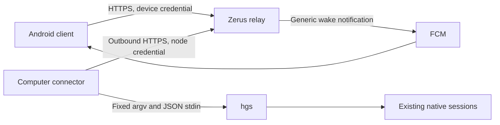

# Mobile architecture

Status: Android pilot, protocol version 1. The Android client,
relay and computer connector live in this repository under the MIT license,
except for attributed Apache-2.0 terminal adaptations from MuxPod. Their source
headers identify the upstream revision, and the APK includes the complete
license in `assets/licenses/mux-pod.txt`.
The existing `hgs` CLI remains the authority for native session identity and input.

## Product boundary

The Android client connects to existing computers, browses logical projects and
sessions, and operates native session workflows: conversations and attachments,
questions, queues, model settings, context, lifecycle actions, process output,
session creation and supported terminals. It preserves private drafts, reading
positions and uncertain delivery receipts. Native capabilities determine which
actions are available for each adapter and running version.

Account enrollment, project catalog administration, desktop filesystem windows
and global recovery policy remain native or desktop setup tasks. Mobile recovery
controls operate individual already-scheduled jobs. iOS can use the same HTTP
protocol later; no Android-specific object is required to operate a session.

## Connection model



Both clients initiate outbound connections to one configurable HTTPS origin.
The computer publishes snapshots and long-polls a command queue. The phone
reads snapshots and submits typed requests. No inbound port, public SSH access,
VPN enrollment or mobile copy of computer credentials is required.

Nebula remains useful for a private relay address or existing desktop peers.
Requiring it on every phone would add VPN provisioning and would not solve
Android background wake delivery. The mobile protocol therefore treats Nebula
as an optional network, independent of pairing and push.

HTTP long polling is used for commands and events. It works through ordinary
HTTPS reverse proxies and provides explicit durable claim semantics. It can
later be replaced with a WebSocket transport without changing command identity.

### Sharing boundary: paired computer and direct peers

The connector exposes an explicitly connected gateway computer and its enabled,
directly configured Zerus peers. The relay keeps the gateway credential separate
from the computers reachable through it.

For example, connecting a phone to computer A should expose A and its direct
peer B. B's connection to C must not expose C through A. Extending access requires
explicitly connecting B or another gateway. A computer appearing as a neighbor
does not itself become an authorized gateway. Multiple explicit connections
expose the union of their individual one-hop neighborhoods, never the transitive
closure of the machine graph. Arbitrary SSH aliases and shared-catalog entries
do not establish a sharing edge.

An explicit gateway connection means owner-authorized connector enrollment in
the workspace. Existing device credentials remain workspace-scoped; this design
does not introduce phone-specific gateway grants. Discovering a neighbor must
never create a connector credential or enroll that neighbor as a gateway.

Discovery, publication and command dispatch must all enforce this same boundary.
The phone cannot supply a multi-hop route or increase discovery depth. A gateway
may execute locally or forward once to a verified direct peer; that peer must
execute locally. SSH credentials remain on their owning computers. Removing a
configured edge or disconnecting a gateway removes the routes depending on it.
Other independently authorized routes remain valid; an explicit computer-level
revocation blocks every route to that computer.

Peer traffic follows the enrolled gateway: phone → relay → gateway → direct
peer, with the reply returning through the same gateway. Pairing Arch therefore
allows access to its configured Mac through Arch; it does not connect the phone
directly to Mac. If Arch is unavailable, its route to Mac is unavailable too.

Stable computer identity is separate from the route used to reach it. A machine
reachable both directly and through another authorized gateway appears once,
with its sessions and drafts preserved. Each submitted request retains its
original target and selected route; claimed or uncertain mutations never move
automatically to another route.

#### One-hop implementation contract

The existing phone API remains unchanged: `GET /v1/computers` returns computers
and `POST /v1/requests` accepts the selected `computer_id`. A relay node is an
authenticated gateway queue consumer. A discovered peer is a computer and a
route, never a node credential or an additional gateway enrollment. Deduplication
is scoped to one authorized workspace; identical native UUIDs in different
workspaces do not combine their authorization domains.

The relay keeps a computer registry and gateway routes separately from node
credentials. Existing node IDs remain valid computer IDs. The first persisted
binding of a native machine UUID chooses its canonical computer ID; subsequent
routes attach to that computer. A newly discovered peer matching an existing
bound local computer does not create another computer. A newly enrolled gateway
for an already visible peer attaches its direct route before first publication.
Historical request bodies and hashes are never rewritten. Legacy IDs remain
accepted lookup aliases. If two different legacy IDs were already published
before their shared native identity becomes known, keep their presentation rows
until an alias-aware client migration can preserve drafts, caches and outboxes;
an old client must not silently lose the computer row referenced by a draft.

The gateway heartbeat has this additive shape:

```json
{
  "snapshot": {"sessions": []},
  "machine_id": "00000000-0000-4000-8000-000000000001",
  "peers": [{
    "route_id": "00000000-0000-4000-8000-000000000002",
    "machine_id": "00000000-0000-4000-8000-000000000003",
    "name": "Example peer",
    "online": true
  }]
}
```

`POST /v1/node/heartbeat` still requires only `snapshot`; `machine_id` and
`peers` are additive. A native UUID binding cannot silently change. `peers` is
an authoritative manifest of at most 32 direct routes; omission withdraws old
peer routes while preserving legacy local behavior. Missing `machine_id` does
not erase an established local binding. The connector generates stable opaque
route UUIDs from its local alias and the pinned target UUID. SSH aliases, host
settings and credentials are not sent to the relay or phone.

Publish each peer separately through
`POST /v1/node/peers/{route_id}/heartbeat`, with body
`{"machine_id":"<native UUID>","snapshot":{"sessions":[]}}`.
The authenticated gateway must already advertise that exact route/UUID pair in
its current manifest. Updating it does not enroll a gateway. Each peer has its
own observation time: fresh Arch heartbeats cannot keep stale Mac data online.
A withdrawn or explicitly offline route becomes unavailable immediately. Existing
body, response and workspace resource limits continue to apply; peer count does
not multiply the permitted size of an individual request or computer response.
Peer snapshot storage is capped at 1 MiB of canonical JSON, as is the connector's
heartbeat envelope. The workspace registry retains at most 2,048 computers,
4,096 aliases and 4,096 routes, including revoked identities. Admission rejects
new registry entries at these bounds rather than dropping revocation records or
request receipts. The combined phone catalog keeps its existing 1 MiB response
budget and checks selected snapshot sizes before loading them.

Computer rows retain `id`, `name`, `online`, `last_seen_at` and `snapshot`.
Additive metadata may include `machine_id`, `aliases` and
`via: {"gateway_id":"<node ID>","gateway_name":"Example gateway"}`;
`via` is null for a direct route. Old phones can consume the normal computer
rows without understanding the additional metadata. Prefer a fresh direct
route, then a fresh peer route ordered deterministically by gateway and route
ID. Capabilities and displayed snapshot must come from the selected route.

New gateways advertise the `gateway_one_hop` feature. At submission, store the
target computer/native UUID and selected route alongside
the request; `requests.node_id` remains its committed gateway. Remote claims add
`gateway_route: {"schema":1,"route_id":"<UUID>","computer_id":"<ID>",
"machine_id":"<native UUID>"}`. New bound local claims include the same envelope
with `route_id: null`, so their execution also verifies the persisted target UUID.
Historical unbound claims keep their existing shape and fingerprint. Guarded
claims cannot be delivered to a downgraded gateway lacking this capability.
Each queue poll must explicitly include `gateway_one_hop=1`; a stored heartbeat
feature alone is insufficient because an older connector may start before its
first heartbeat replaces the previous version's capabilities. Without this
per-poll opt-in, guarded local and peer requests remain unclaimed.
Duplicate submissions return the preserved receipt before checking current route
availability; losing a route does not invalidate a request's durable identity.
Before claiming a queued remote request, recheck its
frozen route; if withdrawn, fail it before delivery rather than choosing another
route. Once claimed, delivery loss remains uncertain and cannot cause requeue
or automatic replay. Result authorization remains bound to the original gateway.
Withdrawal atomically fails queued requests for that route. Re-adding the same
alias/native UUID and deterministic route ID cannot revive those requests;
only a new request UUID can use the restored route. Claim and withdrawal must
serialize their route checks and state transitions. Already executing native
operations cannot be retroactively cancelled by withdrawing a route.

The native ABI consists of `hgs mobile-peers --json` and
`hgs mobile-peer --json`. Discovery returns schema 1, a local
`{machine_id,name}` object, and direct peer rows containing
`{via,machine_id,name,online,error}`; `via` is a configured alias retained only on
the gateway. Unreachable peers may have no newly verified identity. Discovery
does not inspect their neighbors. The dispatch stdin envelope is
`{schema:1,via,target_machine_id,argv,payload}`. It resolves `via` against the
currently enabled local configuration, then invokes the fixed remote
`hgs swarm __mobile-peer-local --json` entrypoint with only
`{schema:1,target_machine_id,argv,payload}`. The destination verifies its own
persistent UUID in the same executing invocation and performs an allowlisted
local operation. It rejects forwarding fields, `@host` routing and arbitrary
commands. Native stdout and exit status remain compatible with existing
connector calls, including JSON inspection and textual capability discovery.
For a bound local target, the connector calls `swarm __mobile-peer-local` locally
with the expected UUID, rather than bypassing its guard. Copying a gateway
configuration or resetting native machine identity must not execute a previously
bound request on a different machine. Discovery may use a fixed private
`swarm __mobile-peer-identity --json` helper returning only native UUID and name.
Production connector calls use `hgs swarm mobile-peers --json` and
`hgs swarm mobile-peer --json`. The existing `swarm` namespace rejects unknown
subcommands on older binaries. This remains safe when a binary is downgraded
between capability discovery and execution; an unknown top-level command could
otherwise enter the generic session launcher. Help requests never execute work.

The connector maintains separate session/archive membership, capabilities,
attention, project and account contexts for each machine. Peer calls use the
guarded native dispatch callback; all contexts share the original durable
connector journal, whose request fingerprint includes the immutable route
envelope for new remote work. Resolving a route never accepts an SSH alias from
a phone or relay. The native dispatcher rechecks the enabled edge immediately
before forwarding, so stale relay inventory cannot authorize a removed peer.
Bound peer fanout, subprocess output and deadlines independently of the fixed
one-hop rule, and keep local heartbeats independent of slow remote probes.
Computer-level revocation covers every route and preserved legacy presentation
alias for that native identity within its workspace. Revoking a gateway removes
its routes only; it does not revoke independently authorized routes elsewhere.
Computer revocation does not revoke a gateway credential on that same machine:
the revoked computer is hidden and cannot be targeted, while its enrolled
connector can still reach other authorized peers. Revoke the node credential to
disable that gateway and all routes depending on it.

## Trust and authorization

Version 1 trusts the selected relay operator with session metadata, messages and
answers in transit through the relay and in its bounded request store. TLS
protects the two network connections; this is **not end-to-end encryption**.
Use a relay you administer for confidential workloads. End-to-end encryption
with computer keys verified during pairing is a prerequisite to promising a
cloud service that cannot read customer content.

An administrator provisions workspaces and computers through the relay's local
CLI. There is no public account registration or HTTP administrative endpoint.
A phone consumes a random, single-use, short-lived invitation, then receives its
own revocable device credential. Computer and phone credentials are separate,
random capabilities; the server stores their hashes. Every lookup includes the
authenticated workspace, and request results are restricted to their requesting
device. A computer can only claim work assigned to its own identity.

Android stores the credential using Android Keystore encryption and disables
application backup. Connector credentials, server push credentials, databases
and signing keys belong in private local configuration, outside source control.
Production clients require HTTPS. Any emulator loopback exception is explicitly
limited to development.

## Delivery safety

1. The phone creates a UUID and durably records the exact draft and target before
   submitting an action. It includes the displayed run and conversation identity;
   question replies also include the exact question ID and fingerprint.
2. The relay records the request before acknowledgement. Reusing its UUID with
   the identical body returns the existing request; changing its body is rejected.
3. Claiming a command is a durable transition. Claimed commands are never put
   back into the queue after disconnection or restart. Old queued commands expire.
4. The connector journals the attempt before invoking a fixed allowlist of `hgs`
   commands. It does not invoke a transport shell or infer a different session
   after the requested session disappears. Explicit Terminal input is delivered
   to the verified existing native pane, which may itself contain a shell.
5. `hgs` verifies the current native identity and its existing input preconditions.
   Successful submission means delivery to the native interface, not a model reply.
6. A timeout or crash after a mutation might have started produces an uncertain
   result. The phone retains its draft and receipt, and requires deliberate review
   before a new attempt. Neither relay nor connector automatically resends it.

Read refreshes can issue new request IDs. Retrying an acknowledged result upload
does not execute the native command again. The connector never restarts native
agents, tmux servers or DeepSeek hosts.

The Android composer and outgoing messages have separate durable state. Sending
atomically moves the current composition into an outgoing envelope before any
network request. The conversation immediately shows its delivery status while a
new composition can be edited. Completion never clears a later draft. Unknown
delivery remains visible and cannot trigger an automatic resend.

Automatic read progress appears only after five seconds of continuous waiting.
Explicit refresh shows progress immediately, including when it promotes an
already-running read. Operation and navigation identities prevent an old
session's response from replacing the current session or hiding its progress.
Catalog and conversation reads share their existing progress state with a thin
top bar; pull-to-refresh keeps its circular indicator. Background reads retain
the same five-second delay and do not start an extra request for either indicator.

## Projects and attachments

The connector reads the canonical logical project catalog with `hgs swarm get`,
separately from the legacy directory aliases in `hgs ls`. The additive
`snapshot.mobile_projects` object contains stable project IDs, names, colors,
the default project, and this computer's folders and exact session membership.
It excludes peer connection settings and synchronization history. Catalog reads
are cached for fifteen seconds; a temporary failure marks the previous catalog
stale instead of discarding it. Android scopes project identity to the paired
workspace, native swarm and project ID, and retains projects with no sessions.

Sessions is the initial Android view. Its desktop-derived filters select all
nonarchived sessions, sessions needing attention, working sessions, saved
sessions, or archives. Machine selection includes the workspace identity.
Filtering and search produce project groups containing only matching sessions;
the separate Projects catalog includes empty canonical projects. Directory
fallback groups remain confined to the session list. Provider badges and filter
glyphs reuse the desktop drawing geometry.

[Telegram's chat behavior](https://github.com/DrKLO/Telegram/blob/master/TMessagesProj/src/main/java/org/telegram/ui/ChatActivity.java)
is a design reference for read positions, unread boundaries, paging and
jump-to-latest controls. Its GPL source is not copied into this client.

Session badges use the desktop semantic palette: working is green, ready is
neutral, input and approval are yellow, errors are pink, and paused is purple.
Inactive rows use neutral badges unless an explicit unread or review-later
marker applies. Labels accompany colors, and attention takes precedence over
routine work.

List previews normalize known native question-response envelopes for display
only. Complete responses show their answers. Native list summaries may already
be truncated; a complete leading answer string can still provide a readable
snippet, while an incomplete value uses a generic question-response label.
Embedded examples, unknown tags and ordinary code remain literal. Preview
formatting never changes raw messages, receipt matching or conversation identity.

Archive inspection carries an explicit `archive_id` in the inspect payload.
The connector checks the exact session-name/UUID pair against a recent local
snapshot and invokes `hgs inspect SESSION --archive UUID`. Both ends verify the
returned archive identity. Live inspection rejects archived results, including
when a same-named live session disappears. Archived conversation content is
read-only; restore, rename, fork and forget remain explicit capability-gated
lifecycle actions. Archive target keys cannot collide with live drafts or
outgoing messages. Archive
rows do not participate in live notification transition detection.

### Native context and prompt cache

Context diagnostics come from the same native inspection as the desktop UI.
`session_usage.context` supplies used tokens, the reported window and any
estimate marker. Missing values remain unknown; the client never guesses a
window from a model name. The desktop's 70% and 90% colors indicate growing
context pressure, not proof that native compaction is required.

Provider prompt cache is separate from the phone's saved conversation history.
Native cold-cache hints override a reported warm cache; an elapsed native TTL
is shown as an estimated expiry. Cache-read tokens from the last request do not
prove that a cache is still warm. A saving suggestion does not prove it is cold.
Archived or cached inspections explicitly remain last-known data.

Compact and clear are fixed native operations scoped to the exact computer,
session, run, conversation and request UUID. The phone saves an operation before
transport, and uncertain delivery is checked without replaying the mutation.
Clear requires confirmation naming its session and computer and preserves the
unsent draft. Moving that draft to a new conversation is restricted to an
active, confirmed clear in the same run; ambiguous or recovered operations keep
the original draft available for explicit restoration.

Compact and continue retains a cancellable send intent only in memory. It waits
for the matching native compaction request to complete and the agent to be idle,
then sends only the original unchanged draft with its native compaction UUID.
An edit, attachment change, navigation, restart, cancellation, failed or unchanged
compaction, or identity change cancels that continuation. Acceptance of the
compact command alone is never completion. Clear and compact never run merely
because context is large or a cache has expired.

### Session controls and native details

The session header exposes the native model and effort catalog. A settings
change made during a busy turn can be scheduled by the native adapter. The
phone retains that authorization and its exact pending-settings ID. While the
client is running, a bounded watcher checks those authorized sessions even when
another conversation is selected. Applying a pending choice has one durable
attempt; a replacement pending ID cancels the old intent. This watcher does not
promise execution after Android stops the application.

Details presents the agent's task lists, goal and reported usage, subagent
activity, and native process inventory. Completing a response is independent of
completing a goal. Historical or partial inventories are labeled accordingly.
Opening a child preserves its parent's composition and viewport. Child input is
available only when the native adapter explicitly supports continuing that child.

Lifecycle availability comes from native `allowed_actions` and
`action_reasons`, rather than an inferred mobile state. `hgs session-action`
accepts an immutable request UUID and exact run, conversation and optional archive
identity. A separate durable receipt claim precedes the existing native helper;
the helper rechecks identity at its own mutation boundary. An abandoned claim is
uncertain and never invokes the helper again. Rename and resume can move an
ordinary unsent draft only after an active, matching result proves the new
target in the same conversation. Question answers and unresolved deliveries
retain their original target.

DeepSeek lifecycle actions use the resident adapter's advertised scoped API and
its current owned handle. An older adapter remains running and reports the
unsupported action. Updating the connector or phone never hot-reloads a host
that owns live agents.

New session uses the computer's installed-provider and sanitized account
catalog, an explicit directory browser and a native launch UUID. Only an
authoritative snapshot carrying that UUID can identify the created session.
An uncertain launch is checked through its original receipt and never repeated
automatically. Ordinary non-Git folders work without creating repositories or
worktrees. The compact form proposes an editable name once per new dialog and
preserves deliberate edits through dependent selector changes. A delayed result
cannot change a later deliberate selection.

Worktree discovery and creation are separate capability-gated operations on the
selected computer. Discovery returns a bounded native catalog; stale data cannot
authorize creation or project membership. Explicit creation pins the source,
verified Git common directory, new branch, destination, base revision and durable
request UUID. Native UUIDs correlate results; the connector's mutation journal
prevents replay. Unknown creation results offer only an original receipt read,
with no automatic cleanup or session launch. Related-worktree placement requires
the fresh native catalog to contain both the chosen checkout and a current saved
project folder, rechecked at connector preflight and native assignment. Peer
commands use the same narrow argument allowlist and never fall back to the
gateway's filesystem.

Questions share one answer and page owner between the inline card and expanded
form. Actions distinguish sending, submitted, known non-delivery and unknown
delivery. An answer is saved before transport, with a bounded aggregate receipt
wait and HTTP cancellation. A successful question receipt retains exact
target/question/hash/request/answer evidence before any inspection refresh; stale
or failed reads cannot reopen it. Draft review and discard cannot bypass that
submitted lock. Successful interrupts retain their separate cleanup behavior.
Approval review accrues only in the visible, focused foreground disclosure.

Ordinary agent messages and non-approval question disclosures render Markdown
with the desktop's CommonMark and GFM feature set: headings, emphasis, lists,
quotes, links, tables, strikethrough, static task markers and code blocks.
Android uses CommonMark Java 0.30.0 with native Compose presentation, not a WebView.
Only explicitly tapped absolute HTTP(S) links open a browser; local file
references remain visible text. Raw HTML is literal, and images display their
descriptions without downloading resources. Native answers, approval commands,
receipts, raw events and delivery identities remain unchanged. Parsing runs away
from the UI thread with two workers and an exact-content cache capped at 128
entries and 4 MiB. The source, nesting, node and table-cell limits are 256 KiB,
32, 8192 and 4096 respectively; failures show the complete original text.

Recovery displays the native waiting job, attempt history and minimum retry
time. Retry now and Cancel retry pin its UUID and exact current session identity.
Retry now changes the native schedule; it does not claim that a provider request
has already been sent. The existing native worker retains its delivery checks.

Mark read and Review later are private phone state. They capture the displayed
message evidence and never answer a question or authorize a native action. With
partial history, Mark loaded replies read acknowledges only that loaded subset.

### Read-only Accounts

The connector advertises the node feature `accounts_snapshot` and adds
`snapshot.mobile_accounts` with `schema: 1`, `available`, `stale`,
`checked_at`, `refresh_interval_seconds: 300`, and `accounts`. Accounts are
identified by the workspace, computer, provider and native account ID. Each row
contains `id`, `provider`, `label`, `native`, `installed`, `is_default` and
`usage`. This viewer never signs in, changes credentials or edits accounts.
An unavailable catalog can indicate an older native CLI; it is not an empty
list of verified accounts.

The local `hgs account ls` catalog is checked every 30 seconds. At most one
background `hgs account inspect ID` runs at once, with a 25-second deadline and
a minimum five-minute interval per account. Provider calls never block the
heartbeat. Shutdown cancels and reaps only the connector-owned CLI child.
Removed accounts and changed credential fingerprints discard previous usage;
adapters without a fingerprint use the native signature-validated catalog
identity and sign-in state conservatively. A failed refresh retains prior
values with `refresh_error` and `stale`, without forwarding provider errors.

Only allowlisted display fields leave the connector: identity name, email,
organization, plan, auth method and account ID; known status/source; reported
quota windows (`id`, `label`, `used_percent`, optional `window_minutes` and
`resets_at`); decimal credit or wallet balances; and freshness flags.
`usage.checked_at` is the native observation time in Unix seconds. The outer
catalog `checked_at` never makes old quotas fresh. The catalog's cached identity
may seed an initial row without quota windows, which remain unknown. Reset
times retain valid native Unix seconds or ISO 8601 timestamps. Invalid numeric
values are omitted rather than converted to zero. Limits are 100 accounts,
16 windows or balances per account, bounded display strings and a 128 KiB
serialized projection. Homes, configuration paths, credential revisions,
tokens, raw errors and arbitrary URLs are excluded. The relay transports this
snapshot through the existing trusted-server connection; no new command or
administrative HTTP endpoint is added.

The synthetic integration fixture supports optional `account_profiles` and
`account_usage` (an object keyed by account ID) in its private fixture config.
These produce account catalog/inspection responses without contacting any
provider or changing a native session.

### Terminal

Terminal is a separate fullscreen view of the existing native tmux pane. It
captures bounded ANSI-styled screen snapshots, preserves horizontal scrolling
and zoom, and freezes the displayed snapshot during text selection. Reads adapt
between 250 ms and two seconds and run only while the view is active. The native
program keeps its existing terminal size; opening a phone does not resize it.

The renderer adapts MuxPod's Apache-2.0 implementation. It accepts bounded SGR
styles and discards terminal control strings, including clipboard and hyperlink
commands. Native cursor coordinates also work on blank lines. The bundled
license and source notices identify the upstream revision and modifications.

Input has a separate encrypted composition and durable receipt. Enter submits
literal buffered text with a newline; Insert text sends it without a newline.
The key toolbar sends a fixed native key vocabulary.
Ctrl+C and Ctrl+D require confirmation naming the session and computer. A text
or key operation pins a fresh terminal binding containing native process and
pane incarnation evidence. The relay gives delivery a five-second deadline,
which the connector and native mutation boundary both verify. An expired
operation sends no bytes, and an uncertain operation is never replayed.
Multiline input requires verified native bracketed-paste support.

Terminal snapshot results expire 120 seconds after entering a completed, failed
or uncertain relay state.
Abandoned claims first become uncertain through claim expiry or relay restart,
then expire on the same schedule. Durable input attempt identities remain.
Authenticated role/IP limits allow
2,400 requests per minute for interactive reads, with a separate global limit
of 6,000 and unchanged invitation limits. Terminal remains capability-gated for
unsupported native adapters, archived sessions and child activity views.

### Conversation history and composition

Opening a conversation presents retained local history when an exact-target copy
is available, while refreshing it in the background. History is keyed by
workspace, computer, session, run, conversation and archive identity. It must
never authorize a message,
answer or interruption: those actions require a fresh verified inspection.
An inspection already in flight is shared across navigation and refreshes;
leaving the screen does not create a second queued native read on return.

The Android history cache is private and encrypted, with atomic files outside
Android backup. It retains at most twenty conversations and twenty MiB for seven
days, with a one-MiB limit per inspection. Disconnecting a workspace purges its
history. Cache failures fall back to a network read and do not damage drafts.
Native message IDs and journal sequence numbers identify rows. Legacy messages
without either use scoped fingerprints; array positions are not message IDs.
History parsing and reconciliation run away from the typing path.

Canonical history uses a separate read operation from control inspection. Each
request verifies the exact native target and returns a bounded page, stable
message IDs, an index epoch and opaque authenticated cursors. Before, after and
around reads preserve server order, including messages with equal timestamps.
An index being built or a missing source explicitly reports incomplete history;
its partial oldest data must not replace the recent conversation already shown.

Stop hooks may contain only the first 1,200 Unicode characters of a reply plus
an ellipsis. Cross-source reconciliation recognizes that native clipping shape
while retaining time and one-to-one matching checks. Older derived indexes are
reconciled in bounded batches; corrected rows retain aliases, and changed
incoming numbering invalidates the old epoch and cursors.

Android retains a separate movable window of at most 500 messages and two MiB.
Paging evicts the opposite end of that window without discarding native history.
An independent encrypted page cache holds at most 128 entries and 64 MiB;
retained viewport pages allow reopening an older reading position. A lightweight
unread-head probe cannot overwrite a full cached page. Metadata checks rotate
between tracked conversations so a slow or unavailable source cannot starve
other unread counts.

Read positions are private to the phone and follow the canonical conversation
across a verified resume. Incoming agent messages count; tool events and the
user's own messages do not. Automatic read progress advances only after
content is actually visible in the active conversation, with overlays excluded.
Opening a session or searching messages alone does not acknowledge them.
An explicit Mark read choice can instead acknowledge the captured fresh complete
head; without that evidence it acknowledges only captured loaded incoming rows.
Exact counters require a complete current index; stale or partial history uses
the larger of its loaded count and last known canonical count as a lower bound,
or an unknown state when neither is available. The read watermark remains valid
for retained rows in the same epoch while offline. A native incoming-sequence anchor locates the
first unread message beyond the latest page. The unread divider stays attached
to that message when legacy inspection IDs gain canonical aliases.

Typing updates the editor immediately. An ordered background writer coalesces
draft edits and performs serialization, encryption and disk writes away from
the UI thread. An edit becomes durable when that background write succeeds;
an abrupt process exit can lose edits still waiting to be written. A send still
requires a successful atomic draft-to-outbox write before any network mutation.
Receipt updates and delayed writes must preserve
newer composition. Only unsent drafts and unresolved deliveries appear in Drafts;
successful delivery status belongs to the message in its conversation.

The multiline composer keeps one editor state for text, selection and IME
composition across polling, expansion and sending. Sending brings the new local
message into view. Incoming updates follow the tail only while the user is
already following it; otherwise the reading position and a jump-to-latest action
are preserved. Application status belongs above the input, with only system
insets below it. Sending and uncertain-delivery notices must not move the field;
blocked-send explanations remain accessible without adding a footer row.
Ordinary question forms place their send icon beside the last Other input, or
beside paging and Skip when no such input exists. Enter submits the focused
question form through the same availability checks as its icon.
This follows Android's guidance for
[text input state](https://developer.android.com/develop/ui/compose/text/user-input),
[stable list keys](https://developer.android.com/develop/ui/compose/lists), and
[limiting repeated UI work](https://developer.android.com/develop/ui/compose/performance/bestpractices).

Android imports explicitly selected documents into private encrypted immutable
files. Drafts and outgoing envelopes refer to those snapshots, so later changes
to the source document do not change a pending message. A send uses the existing
native `attachments: [{name, mime, data_base64, reference?}]` contract. No phone
supplied path is opened on the computer. `hgs` creates its own private attachment
files and retains them when input may have reached the native agent.

Limits match native input: eight files, ten MiB per file, twenty MiB total and
64 KiB of message text. `/v1/requests` accepts a bounded 29 MiB JSON envelope;
other request bodies remain limited to one MiB. Relay and connector independently
validate attachment metadata, canonical base64 and decoded sizes. Retained
request bodies have a 100 MiB per-workspace budget with one additional MiB
reserved for small text and control operations. A full budget rejects new
requests without evicting uncertain attempts or changing existing receipts.

## Protocol version 1

Authenticated requests use `Authorization: Bearer <credential>`. Bodies and
responses are JSON. Session names are JSON values, never URL path components.
API errors carry an `error` string. Relay health reports the protocol version.

| Method and path | Role | Input or result |
| --- | --- | --- |
| `GET /healthz` | Public | Health and protocol version |
| `POST /v1/pair` | Invitation | `{code, device_name}` → `{device_id, device_token, workspace_id, workspace_name}` |
| `GET /v1/capabilities` | Device | Protocol version, operations, inspect extensions, push providers and attachment limits |
| `GET /v1/computers` | Device | `{computers: [{id, name, online, last_seen_at, snapshot}]}` |
| `POST /v1/requests` | Device | `{request_id, computer_id, operation, session, payload}` → request envelope |
| `GET /v1/requests/{id}` | Owning device | Request envelope |
| `GET /v1/events?after=N&wait=25` | Device | `{events: [...], cursor}` |
| `POST /v1/push` | Device | `{provider: "fcm", token}`; other providers return 400 |
| `DELETE /v1/push` | Device | Remove this device's push registration |
| `DELETE /v1/device` | Device | Revoke this device, its queued requests and push registration |
| `POST /v1/node/heartbeat` | Computer | `{snapshot}` using local `hgs ls --json --local` output |
| `GET /v1/node/requests?wait=25` | Computer | `{requests: [{request_id, operation, session, payload}]}` |
| `POST /v1/node/requests/{id}/result` | Computer | `{state, result, error}` |

An envelope contains `request_id`, `state`, `result` and `error`. States are
`queued`, `claimed`, `completed`, `failed` and `uncertain`. The base operations
are `inspect`, `send`, `answer` and `interrupt`. Additive operations include
`compact_context`, `clear_context`, `send_now`, `settings`, `process_output`
and `process_stop`, native lifecycle actions, `terminal_snapshot`,
`terminal_input`, `history`, `catalog`, `dirs`, `launch`, `worktrees`,
`worktree_create` and `recovery_action`.
Both relay capabilities and the computer snapshot's
`mobile_capabilities` must advertise an extension before the phone uses it.

Legacy live `inspect` accepts an empty payload; an archive supplies its canonical
`archive_id`. The `inspect_after` and `inspect_agent` features add a journal
cursor or exact child ID, together with the expected parent run and conversation.
Child history retains its own identity and never replaces the parent's draft or
fresh control state. Inspect returns native `hgs inspect` JSON; bounded public
history may be omitted as whole rows with explicit truncation metadata, while
question disclosures and other control metadata remain intact.

Mutations carry the corresponding existing `hgs --json` input, with the same
`request_id` as the envelope. Queue promotion pins the native queue fingerprint.
Applying pending settings pins `expected_pending_id`; a scheduled result is not
an applied setting. Process output and stop use fixed CLI arguments with exact
run, conversation, process and optional native generation identity. A process
stop acknowledgement of `requested` does not claim that the process has exited.
Read results have short retention; mutation attempt identities remain durable
after large result bodies expire.

History selectors are mutually exclusive: newest, `before`, `after`, `around`,
or `around_incoming_seq` together with an exact `history_epoch`. Pages contain at
most 100 public rows. A bounded connector read can advance initial indexing
locally for up to two seconds and 32 native reads, avoiding a network roundtrip
per index chunk. Cursored reads execute once. A partial resident adapter is
reported as partial rather than a completed conversation.

`last_seen_at` and event `created_at` use Unix epoch seconds.

## Notifications

The relay detects attention, failure and completion transitions from computer
snapshots. An initial baseline is silent. Push payloads contain only generic
wake information, never conversation text, project names or credentials. Opening
a notification refreshes the authenticated session state.

Android notification preferences distinguish input and approvals, errors, and
turn completion. Input and errors are enabled by default; completion is opt-in.
The master Session alerts switch controls all three. Each paired workspace,
canonical computer and live session slot has one replaceable notification,
showing its current authenticated session title and the computer's private name
on this phone. The explicit lock-screen public version remains generic and
never includes question text or conversation content.

Push is only a wake hint and does not create a second visible alert. The client
drains bounded event pages, coalesces session slots and validates candidates
against one current computer catalog per batch. It saves dedicated encrypted
notification state, independently of drafts, to avoid repeating an unresolved
question after another wake or application restart. Historical backlog is
silent; initial synchronization does not announce old completed turns. Turning
off an event type removes that type's existing session cards.
The card budget is shared across paired workspaces. Existing eligible cards are
kept to avoid eviction churn; one global summary represents excess needs, and
later promotions to individual cards are silent. The summary opens the app
without pretending to identify a particular session.
Cards reconcile on events, settings changes and application startup. Resolving
input and returning to work does not itself emit a relay event, so removal of
that card can wait for the next reconciliation. Empty event polls do not fetch
the full computer catalog.

The event schema contains a session slot but no historical run or conversation
identity. A notification therefore opens the freshly resolved current live
session, with no archive fallback. Stale completion events cannot replace a
current input request or error. Completion alerts require a previously observed
matching current run and conversation and a recent event newer than that
observation. These timestamp checks conservatively filter stale history; they
cannot prove the historical event's run identity. An unobserved or replaced
conversation is suppressed.

Optional Codex questions are discovered by a bounded rotating inspection of two
live sessions per connector heartbeat. Only their IDs and fingerprints are added
to snapshots. With many live Codex sessions, these alerts can lag by a complete
scan cycle; ordinary native attention phases arrive with the next heartbeat.

Android supports two delivery paths:

- FCM for a build configured with the operator's Firebase Android application,
  with server credentials supplied privately. No service-account key belongs in
  an APK. FCM configuration is optional for building the application. The app
  registers automatically and shows per-workspace push status in Machines.
- A user-enabled foreground live connection, with a visible service notification,
  for builds without Firebase and phones without Google Play services. This needs no third-party
  account. It consumes an ongoing connection and does not promise FCM-equivalent
  behavior under Doze, vendor battery restrictions or force-stop.

Android 13 and later require notification permission. Force-stopping the app
and disabling notifications cannot be bypassed by the relay. Provider status
must be shown honestly in the app and deployment verification.

References: [Android foreground service types](https://developer.android.com/develop/background-work/services/fgs/service-types#remote-messaging),
[FCM Android setup](https://firebase.google.com/docs/cloud-messaging/android/get-started),
and [FCM server authorization](https://firebase.google.com/docs/cloud-messaging/send/v1-api).

UnifiedPush was removed on 2026-10-10 because it was unused. The relay never
sends requests to client-supplied URLs. Restore it from Git history if needed.

### Application settings

The main Android toolbar orders New session, Refresh and Settings. Settings is
a full-window screen with its own Back action; it retains the underlying tab,
project, filters, scroll position and drafts. It contains telemetry controls,
the application version, a direct GitHub repository link, update controls and
an offline third-party notices page. Back from notices returns to Settings;
Back from Settings returns to the previous workspace view.

Update discovery and installer recovery remain active independently of whether
Settings is open. Available updates and pending installer sessions mark the
Settings icon. Opening or recomposing Settings does not submit a download or
installation. Machine notification, live connection and push setup controls
remain in Machines.

### Firebase diagnostics and usage analytics

The managed Android pilot uses Firebase Crashlytics, Google Analytics for
Firebase and FCM. These are independent services: disabling usage analytics or
crash reports must not disable push delivery or change session notification
preferences. Builds without the optional Firebase configuration retain the
foreground live connection.

Usage analytics is enabled by default, as requested by the owner. The app's
settings expose separate Usage analytics and Crash reports switches, initially
on. A saved choice applies across process restarts and background-only starts.
Collection is gated during initialization until the saved preferences have been
applied; the app must not briefly enable analytics for a phone that opted out.
Analytics is initialized lazily after a saved opt-in. Its eager Firebase
connector registration is removed, and its three Android measurement entrypoints
are disabled before saving an opt-out. This also prevents old SDK jobs from
starting collection while the app is closed; Crashlytics and FCM stay available.

Crash reports upload on a subsequent application start when reporting is on.
The SDK's automatic upload stays disabled; the app uses the documented manual
send and delete APIs to enforce the saved preference. Opting out records a
durable discard boundary. Enabling reports again requires a restart and does
not clear that boundary until a later startup observes an empty retained-report
queue. Reports from the first resumed period can be discarded during this
cleanup. Ordinary on-to-on launches preserve and send the preceding fatal
report. This deliberate upload policy does not provide the SDK's full automatic
crash-free session metrics.

Custom analytics events and diagnostic context use a small static allowlist of
event names and enum values. Session content, session and computer labels,
project paths, account identities, pairing links, relay URLs and credentials do
not belong in those events or breadcrumbs. Advertising identifiers,
personalized advertising and automatic screen reporting are disabled. FCM wakes
contain no conversation content; authenticated relay reads continue to determine
which local session alert, if any, should appear.
The Crashlytics SDK additionally records technical stacks, thread information
and installation identifiers; thread metadata can include a gateway address.
The settings disclosure distinguishes this SDK metadata from the restricted
custom context. These controls do not make a Firebase installation anonymous.

The Android Firebase configuration is a private build input. Relay push
credentials are a separate private server input and never enter the APK or
source archive. Prefer a dedicated service account with only
`cloudmessaging.messages.create` in the target project. Cloud administration
permissions and runtime push permissions are separate operational concerns.

Every shipped minified APK requires its exact R8 mapping, retained privately
with the APK hash, source revision and build identifier. Crashlytics mapping
upload must use that build's mapping; rebuilding an already published version
does not recover its symbols. Mapping files are excluded from public release
assets and update catalogs. A private test crash and subsequent application
restart qualify upload and decoding before a Firebase-enabled pilot is
published.

References: [Analytics collection controls](https://firebase.google.com/docs/analytics/android/configure-data-collection),
[Crashlytics Android setup](https://firebase.google.com/docs/crashlytics/android/get-started),
[R8 mapping upload](https://firebase.google.com/docs/crashlytics/android/get-deobfuscated-reports),
and [FCM permissions](https://firebase.google.com/docs/projects/iam/permissions).

## Self-hosting and future managed service

### Public distribution and update channels

GitHub published releases are the authoritative source of distributable binaries.
The public website at `https://zerus.dev` mirrors release assets and serves small,
anonymous update catalogs independently of the session relay. Downloading an app
or checking its version requires neither a workspace nor a managed-service
account. Publishing requires maintainer credentials; those credentials never
ship in clients. The website is static; a bounded scheduled mirror job pulls
published releases rather than accepting arbitrary public uploads.

The versioned catalog paths are `/updates/v1/android/dev.json` and
`/updates/v1/desktop/stable.json` or `/updates/v1/desktop/nightly.json`.
Catalog schema version 1 identifies the product, platform, channel, display
version, GitHub release ID, publication time, release URL, source commit and
artifacts. Android additionally supplies its integer `versionCode`. Each
artifact carries its immutable name and download URL, size, SHA-256, operating
system and architecture; APKs also carry their package name, minimum SDK and
signing-certificate fingerprint. Desktop catalogs may carry exact package
versions by AUR package name. Clients ignore unknown fields but reject mismatched
product/platform/channel, unsafe URLs and unsupported schema versions.

The mirror verifies metadata and bytes against the GitHub release and its
checksums before publishing `/downloads/<release-tag>/<asset-name>`. Versioned
assets are immutable. A catalog pointer changes atomically only after its assets
are complete. A failed synchronization retains the previous working catalog.
Android dev, desktop stable and desktop nightly are independent release streams;
GitHub's generic latest-release endpoint cannot select all of them. Development
source snapshots must explicitly disclose their base commit and uncommitted
source provenance, and include their exact source archive; they must not claim
to have been built solely from the base commit.

Android compares integer version codes, downloads outside the UI thread and
verifies APK identity, bytes and signing compatibility with the installed app
before handing it to the system package installer. Installation is explicit,
preserves durable drafts, and must not interrupt an unresolved mutation. A
pending installer session is recovered by identity rather than committed again.
The initial updater requests system confirmation; it does not promise silent
installation. Distributed development builds use one durable private signing
identity across machines, preserving upgrades from the pilot. They must not use
an independently generated debug key on each build machine.

Desktop installation ownership remains with the installer. Pacman-owned AUR
packages use their actual installed package name/version and Arch version
comparison; update UI provides package-manager instructions and never replaces
owned files or invokes privilege escalation automatically. VCS/source builds
retain explicit source-update instructions. A platform without a published
installer must not be presented as having an automatic installer. Updating the
GUI or checking releases never stops native agents, tmux or DeepSeek hosts.

The managed relay uses `https://relay.zerus.dev`. Self-hosted relay URLs remain
configurable. An existing gateway hostname may proxy the same authoritative
relay after migration: this preserves paired workspace IDs, credentials,
endpoint-scoped caches and connector receipt namespaces. A hostname migration
must never create two independently executing copies of the workspace database
or silently change an existing client's identity scope.

### Relay service boundary

The relay is a separately deployable service with persistent PostgreSQL storage
and a TLS reverse proxy in production. SQLite remains a single-process local
profile. See [the relay architecture](relay-architecture.md) for the deployed
worker, admission, accounting and database boundaries.
Backups include the database and operator-managed push configuration; restoring
does not justify replaying claimed commands. Removing a device revokes its
credential and push registration. Logs must omit authorization headers,
invitation codes, push endpoints and message bodies.

The future managed offering uses this same API and connector, adding account
authentication, workspace membership, enrollment UI, quotas, audit/retention
controls and billing around it. Device credentials remain individually revocable.
No vendor-only hostname or SaaS subscription is embedded into the core protocol.

Multiple production workers use shared PostgreSQL transactions and event
coordination; running several SQLite relay instances behind a load balancer is
unsupported. Additional workers do not provide database high availability.
Before a public paid launch, complete external security review, cloud account
lifecycle and deletion, operational monitoring, customer key verification/E2EE,
and release signing. These are launch requirements, not features claimed by the
first installable client.
