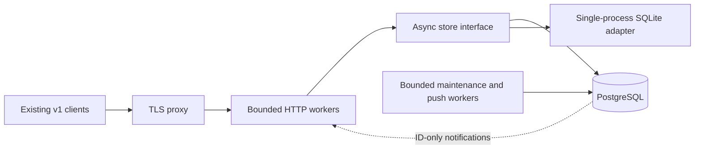

# Relay storage and admission architecture

The current server runtime is Rust; see [its implementation and qualification
contract](../services/mobile/relay/README.md). API v1, database identities and
no-replay guarantees below remain authoritative. Sections describing Python
executors, the GIL, parser allocation and the 2026-10-09 measurements describe
the reference implementation and historical deployment, not Rust performance.

This is the implementation contract for the October 2026 relay audit remediation
(`zerus-6ir`, `zerus-bp9`, `zerus-bou`, `zerus-cvz`, coordinated by `zerus-rvc`).
It records the implemented boundaries, isolated validation evidence and the
owner-authorized production cutover on 2026-10-09. Larger fleet capacities remain
planning targets.

## Decision

Use PostgreSQL with an asynchronous connection pool for production and multiple
HTTP workers. Retain SQLite for existing local installations and development,
behind a serialized asynchronous adapter. SQLite is a single-process operating
mode, not the distributed production queue. Neither changing SQLite journal mode
nor moving its calls to threads establishes a horizontally scalable service.

The important boundaries are authenticated admission, durable transactions,
notification-driven waiting, and bounded payload processing. PostgreSQL alone
does not fix anonymous quota interference, JSON memory amplification, or
unbounded retention.



Keep workspace, computer, device and request identifiers; token hashes; pairing
codes and expirations; event cursors; connector journal binding; and API v1
envelopes unchanged. This remains a trusted relay protected by TLS, without a
claim of end-to-end encryption.

## Durable delivery and transactions

Request identity is the existing UUID and canonical body hash. Never recompute
historical hashes with different canonicalization rules. A duplicate UUID with
the same owner and body returns the existing receipt; a changed owner or body
conflicts. Mutating requests retain their identity tombstones indefinitely.
Retention may remove their payloads but may never make their UUID executable
again. Read-only operations retain their existing shorter retention policy.

Claim exactly one eligible queued request in a committed transaction before
returning it. PostgreSQL uses row locking and a conditional queued-to-claimed
transition; `FOR UPDATE SKIP LOCKED` is suitable for concurrent queue consumers.
The claim checks node/device revocation, normal queue TTL and terminal-input
expiry immediately, even if maintenance is delayed. Network delivery happens
after commit. Lost delivery stays claimed and eventually becomes uncertain;
it is never requeued. A late result cannot resolve an uncertain mutation.
PostgreSQL documents the intentionally inconsistent queue view produced by
[SKIP LOCKED](https://www.postgresql.org/docs/18/sql-select.html).

A worker restart must not mark other workers' claims uncertain. PostgreSQL
relies on claim deadlines, not a startup-wide update. An explicitly exclusive
SQLite process may retain its previous restart recovery behavior. Result
acceptance and request inspection perform only the relevant request's expiry
check, without global maintenance.

Transactions also coordinate duplicate submissions, credential revocation,
queue counts and byte accounting. Use a consistent lock order (workspace
accounting row before affected request rows) to avoid deadlocks. Retried
transactions must never rerun an external operation. Never hold a transaction
or pool connection while awaiting a client or push provider.

## Tenant budgets and results

Maintain exact workspace counters for queued/claimed requests, retained reads,
retained mutations, request bytes, result/error bytes and reserved result bytes.
Update them in the same transaction as the corresponding row changes. Admission
locks the workspace counter row rather than summing all historical requests.
Production enforces a 32 GiB fleet payload budget through 64 fixed accounting
shards, mapping each workspace by a stable hash. Each shard has a 512 MiB share;
independent workspaces do not serialize behind a singleton accounting lock.
A busy shard can reject admission before other shards fill. Capacity is not
redistributed automatically. All workers must use the same allocation settings.
Workspace payloads default to 100 MiB, with a separately bounded 1 MiB small
control allowance; retained reads are capped at 5,000 and mutation identities at
100,000 per workspace. Provisioning count, event storage, physical database
capacity and backup size remain operator constraints.
The retained body budget becomes the retained payload budget:

```text
retained request bytes + retained result/error bytes + result reservations
    <= configured workspace payload budget
```

Reserve the maximum accepted result size when a new request is admitted. The
initial result ceiling is 1 MiB of canonical UTF-8 result and error data. The
HTTP wire limit alone is insufficient: JSON escaping can expand stored bytes.
A result consumes its own reservation and releases the excess, so another
request cannot consume capacity needed to acknowledge an already claimed
operation. Repeated identical results do not increment counters. Oversized
results receive 413; they are not silently truncated or acknowledged as saved.

If retaining the existing small-control allowance, make it a separately bounded
part of the same accounting rather than an uncharged escape hatch. Release
reservations on terminal expiry/revocation and on result acceptance. Release
retained bytes when their corresponding payload is removed; preserve mutation
tombstones and hashes. Count Unicode and error strings in bytes. Add explicit
reconciliation checks for counter drift.

Migration imports existing data faithfully, computes counters and reserves
capacity for pending requests. Legacy workspaces already above the new budget
must be reported and blocked from new admission until below it. Do not delete
existing receipts or turn an accepted claim into a queued command to meet a
budget. Migration must state how oversized legacy results are handled without
altering their identity or outcome.

## Proxy identity, rates and concurrent admission

Default to the socket peer as client identity. Accept `X-Forwarded-For` only
when that peer belongs to configured `trusted_proxy_cidrs`. Walk a bounded,
validated address chain from right to left through explicitly trusted hops;
the first untrusted address is the client. Ignore forwarding headers from an
untrusted peer. The proxy must overwrite or correctly append its verified
client address. Do not trust an arbitrary leftmost address or every private
subnet. Reject malformed trusted chains without logging their values.
[aiohttp deliberately ignores forwarded headers by default](https://docs.aiohttp.org/en/stable/web_advanced.html#deploying-behind-a-proxy).

Anonymous authentication failures and pairing attempts have their own bounded
rate state and admission lanes. They do not debit an authenticated user's
credential/workspace quota or a single global request counter shared with all
legitimate users. Authenticated admission is keyed by verified credential and
workspace. Health remains independent of database availability and rate state.
Readiness coalesces one bounded database probe with a one-second cached result;
concurrent anonymous callers do not create additional database waiters.

PostgreSQL-backed limits and leases apply across workers; local emergency
transport limits protect each worker. A shared workspace limit must not
multiply with the worker count. Bound both rate-state cardinality and its
expiry cleanup. Apply backpressure before body ingestion. Return 429 with a
retry hint for occupied capacity; do not create unbounded semaphore waiters.

Cap active long polls per credential, workspace and worker. Implemented defaults
are 2 per credential, 32 per workspace and 256 per worker, configurable after
measurements. A durable lease expires after a bounded deadline so worker death
does not leak admission indefinitely. Cancellation, timeout and disconnect
release it promptly. Lease expiry and release are idempotent. No DB connection
is reserved for an idle long poll. Successful lease acquisition transfers the
request out of ordinary authenticated admission. Local poll capacity remains
held through cancellation-drained durable lease cleanup. PostgreSQL cleanup
acquisition is separately bounded by configured worker poll capacity plus the
maintenance batch, so mass disconnects do not compete with ordinary queries.

## Bounded v1 payload handling

Existing phones and connectors use inline base64. Preserve their v1 wire
format and attachment size limits. The default is one admitted large payload
pipeline per 256 MiB HTTP worker.
The permit covers ingestion, parsing, validation, storage encoding, claim
retrieval and outbound response serialization until the response is written
or abandoned. Gating only uploads leaves equally large claim responses able
to exhaust memory. Bound ordinary body processing and response concurrency too.

Validate base64 in aligned bounded chunks instead of simultaneously allocating
the entire decoded file and its re-encoded copy. Bound JSON depth and aggregate
structure so dense arrays/maps cannot expand an otherwise small wire body into
unbounded Python objects. Reject compressed request bodies. Do not infer a small
body from a missing `Content-Length`. Parsing and SQLite work run outside the
HTTP event loop, using bounded worker queues. HTTP owns one large-payload
executor thread and four small-work threads; PostgreSQL CPU work uses the same
request executor when called from HTTP, with a separate bounded fallback for
non-HTTP callers. SQLite uses its serialized adapter thread. A cancelled await does not stop
its underlying thread: keep admission until that work actually finishes.

Use streaming responses or bounded spooling to avoid duplicate full-size output
buffers. A streaming encoder must not assume each JSON token is small: a single
base64 string may be tens of MiB. Keep all spools private and account for their
disk use. The private disk-backed spool reserves at most 64 MiB per worker,
with 32 MiB per claim and 1 MiB per ordinary response; it is not placed in the
worker's small tmpfs. Catalog retrieval preflights stored aggregate size before
materialization. Phone catalogs and receipts enforce their actual escaped 1 MiB
wire ceiling before headers. Event pages return a fitting prefix and advance
only through returned IDs. An oversized legacy row fails explicitly rather
than being silently truncated. Result receipt envelopes must fit before a
result is acknowledged.

The byte parser preflights depth 32, 50,000 lexical values, individual mixed-width
string wire size of 1 MiB and aggregate projected string allocation of 48 MiB.
It parses the grammar without decoding the entire document into a potentially
four-byte Unicode string. Scalar and escaped string decoding retain standard
library semantics, including large integers and surrogate escapes. Plain ASCII
base64 is decoded separately; valid JSON escaping is preserved. Parser and
worker cleanup explicitly break reference cycles on success and failure, so
raw bodies are released even when cyclic garbage collection is disabled.
[StreamResponse.write](https://docs.aiohttp.org/en/stable/web_reference.html#aiohttp.web.StreamResponse.write)
provides asynchronous output, but the application still owns buffer bounds.

For this compatible release, canonical request/result payloads may remain in
PostgreSQL text columns. PostgreSQL
[TOAST](https://www.postgresql.org/docs/18/storage-toast.html) stores large values
outside the ordinary row, but driver retrieval still materializes values in
worker memory. Do not mistake TOAST for a streaming object store. Strict quotas
and admission make this an explicitly bounded design. Separate metadata
queries from payload reads so authentication, lists and cleanup never fetch
large request bodies accidentally.

For a later capability-negotiated binary protocol, use immutable blob objects
with workspace/credential ownership, size/hash verification, reservation before
upload and atomic metadata attachment. Uploads and downloads must stream;
unfinished objects need expiry and orphan cleanup. Legacy inline clients still
use the bounded compatibility lane. Object-store presigned URLs are bearer
capabilities and need narrow scope and expiry. Do not introduce an unused S3
dependency or claim this future transport is already implemented. The current
audit can close only on demonstrated v1 bounds; it does not certify unbounded
attachment throughput.

## Waiting, maintenance and push

Subscribe before reading the queue/event table. Use an in-process generation
counter for each `node:<id>` and `workspace:<id>` topic: capture generation,
query durable rows, then await a change only if no rows were found. Prune idle
topic state. PostgreSQL notifications carry only these identifiers; all results
are read from authoritative tables after authorization.

Maintain one dedicated LISTEN connection per worker outside the query pool.
On reconnection, resubscribe and wake local waiters. Recheck durable state at a
bounded fallback interval (initially five seconds) because notifications are
not a durable queue. PostgreSQL delivers notifications after commit and has a
startup subscription race; initialize the listener before the first state
query. See [NOTIFY](https://www.postgresql.org/docs/18/sql-notify.html) and
[LISTEN](https://www.postgresql.org/docs/18/sql-listen.html). Pool reset removes
listeners, so do not return the dedicated connection to the pool between
waits; see the [asyncpg pool contract](https://magicstack.github.io/asyncpg/current/api/index.html#connection-pools).

Run global retention on a separate cadence, with an elected/locked PostgreSQL
maintenance worker and bounded batches (initially 256 rows). Index deadlines
and retention predicates, process oldest eligible rows first, and commit between
batches. Do not run maintenance on every HTTP poll, receipt read or heartbeat.
Use indexed counters/watermarks for event caps; avoid global `NOT IN` scans.
Preserve just-in-time claim and result expiry checks independently.

Push jobs need durable exclusive claims/leases across workers, bounded parallel
delivery and retry deadlines. A notification is merely a wake hint; it carries
no request body, session content or provider token. Provider calls happen
outside transactions. Preserve DNS pinning, exact allowed hosts, redirect
rejection and credential revocation checks.

## Store contract and implementation boundaries

HTTP handlers and push workers access an async store, never a raw connection.
The synchronous SQLite `Store` remains available for offline administration and
existing fixtures; its adapter serializes bounded operations off the event loop.
Production uses `PostgresStore` with bounded pool acquisition and statement
timeouts. Credentials and DSNs are read from private runtime configuration.

The agreed high-level interface is:

```text
authenticate(secret, role) -> credential | None
authorized(id, role) -> bool
pair(code, name) -> pairing | None
computers(workspace_id, max_bytes) -> rows | None
submit(device, body, max_queue, max_bytes) -> status, envelope
get_request(device, id, queue_ttl, claim_ttl) -> envelope | None
has_pending(node, queue_ttl) -> bool
claim(node, queue_ttl, claim_ttl) -> commands
result(node, id, body, claim_ttl) -> status
heartbeat(node, snapshot)
events(workspace_id, after, max_bytes) -> rows | None
register_push(device_id, provider, target)
delete_push(device_id)
revoke(role, id) -> bool
maintain(queue_ttl, claim_ttl, retention, batch_size)
acquire_poll(role, credential_id, workspace_id, ttl, max_credential, max_workspace)
release_poll(lease)
generation(topic) -> integer                         # synchronous local read
wait(topic, after, timeout)                         # asynchronous wait
ready() -> bool
close()
```

All methods except `generation` are awaited. Store-owned push methods encapsulate
registration reads, leased job selection and completion. The transport layer
owns validation, trust configuration, local memory admission and HTTP responses;
the store owns durable quotas, distributed leases and identity/state transitions.

## Migration and cutover

Provide an offline, explicit SQLite-to-PostgreSQL migration command. It reads a
consistent SQLite backup and imports into an empty target in a transaction,
refusing a nonempty or mismatched target. Preserve all IDs, token/code hashes,
request body hashes, states, timestamps, push registrations and event IDs; reset
sequences above imported maxima. Rebuild counters from imported rows. Verify
row counts and deterministic per-table content digests without printing secrets.
Reject inconsistent input rather than inventing missing mutation identities.

Rehearse with synthetic fixtures including claimed commands, ancient tombstones,
revoked credentials, Unicode results and a workspace already over budget.
Require duplicate submit/claim, result idempotency, revocation and event cursor
tests against the imported database. Exercise two independent HTTP workers,
listener disconnect/reconnect and worker restart while another owns a claim.

The live cutover requires a reviewed candidate, backup/restore evidence and an
explicit owner approval. Pause relay admission, drain or conservatively preserve
outstanding claims, stop only relay writers, take the final consistent backup,
import/verify, then start the PostgreSQL-backed relay. Native agents, tmux and
DeepSeek hosts are outside this operation. Keep connector URLs and credentials
unchanged. Never run old SQLite and new PostgreSQL writers against divergent
copies. Before new writes, rollback can restore the unchanged old relay;
after new writes, rollback requires preserving new receipts through a verified
reverse migration or forward repair. Merely switching back to the old snapshot
would reopen mutation replay risk.

The 2026-10-09 deployment uses revision `b8fa821` with two HTTP workers, each
limited to 256 MiB, and a shared PostgreSQL database. The final import matched
all eight source-table digests, allocation counters and sequence high-water
marks after the command queue drained. The runtime database role has no
superuser, database-creation, role-creation, replication or RLS-bypass privileges.
An authority marker prevents subsequent deployment or backup of the frozen
SQLite database as the live backend. Both the rehearsal archive and the first
scheduled-backup-format production archive were restored successfully into
separate databases. Live synthetic checks verified cross-worker notification,
single claim, shared receipts, duplicate suppression, conflict rejection and
credential revocation. This deployment retains one database failure domain;
multiple HTTP workers alone do not provide database high availability.

## Evidence required before claiming completion

The initial cluster planning target is 10,000 active computers and 50,000
connected phones, not a claim of demonstrated capacity. Installed connectors
send full heartbeat snapshots every five seconds: 10,000 computers already
produce about 2,000 heartbeat requests per second, before phone activity.
At 100,000 computers that becomes 20,000 per second. Byte volume depends on
sessions per snapshot; a 20 KiB snapshot at the initial target is roughly
40 MiB/s of ingress before protocol overhead. Database selection cannot remove
that wire cost.

Avoid rewriting unchanged snapshot content: compare a stable snapshot digest
and update liveness separately, without fetching the previous large snapshot
unless its digest changed. This reduces parsing/writes on the storage side;
legacy clients still send the full payload. A future explicitly negotiated
light heartbeat or snapshot delta reduces ingress but is not part of the four
audit fixes. Likewise, change-only phone event wakes should not turn into
unconditional full-snapshot broadcasts to every device.

Load profiles must distinguish idle connected clients, steady heartbeats,
bursts after wake/reconnect, small interactive mutations, maximum attachments,
and worker/database interruption. Choose worker count from measured memory,
CPU, connection and bandwidth budgets; a bounded 256 MiB worker is not expected
to serve the entire planning target. A five-second fallback database check per
idle client is itself a capacity cost and must be measured, then improved by
coalescing waits for shared workspace state before increasing client count.

First scale HTTP workers against one PostgreSQL primary and measure pool wait,
transaction latency, WAL volume and autovacuum. When that envelope is exceeded,
route all records for one workspace to the same database shard, keeping its
requests, quotas, identity ledger and events together. Shard routing and event
cursor compatibility require a deliberate migration and routing directory;
do not transparently scatter request rows or assume cross-database transactions.
Hot workspaces still need their own admission limits. Retained mutation identity
must remain queryable after archival or shard movement. These are explicit
growth boundaries, not capabilities established by the initial implementation.

Run the existing functional suite plus adversarial proxy, quota, Unicode,
revocation, duplicate result, expiry and cancellation tests. Measure peak worker
RSS for concurrent maximum legitimate uploads and claim downloads, malformed
dense JSON and slow clients. Measure health latency during a locked SQLite
writer and slow PostgreSQL statements, and compare idle polling/maintenance
work at 0, 100,000 and larger retained histories. Include cross-worker admission
and duplicate-claim tests against a real isolated PostgreSQL instance.

Report request rates, worker counts, dataset sizes, admission rejections, memory
and latency from the tested setup. Default limits are safety bounds, not a
throughput promise. PostgreSQL storage, WAL/autovacuum, backup volume and the
retained mutation ledger still need operational sizing as traffic grows.

## Measured envelope, 2026-10-09

These synthetic loopback results validate the bounded implementation; they are
not a production fleet benchmark. The reusable probes are
[`relay_scale.py`](../services/mobile/tests/relay_scale.py) and
[`relay_load.py`](../services/mobile/tests/relay_load.py). Python 3.12.13 ran two
HTTP processes against an isolated PostgreSQL instance. The scale dataset had
100,000 mutation tombstones and 100,000 event rows. Maintenance and provider
push were disabled in this short probe; heartbeats sent full small snapshots
every five seconds. Ordinary metadata concurrency was eight, with a separate
burst at concurrency 32.

| Profile | Observed admitted polls | Heartbeat p95 | Metadata p95 | Health p99 | Event wake p95 | Worker RSS high-water |
| --- | ---: | ---: | ---: | ---: | ---: | ---: |
| 200 workspaces, 400 poll attempts | 400 | 60.7 ms | 5.13 ms | 0.85 ms | 152 ms | 49.5 MiB |
| 1,000 workspaces, 2,000 attempts, default caps | 512 | 52.0 ms | 7.52 ms | 1.44 ms | 165 ms | 50.9 MiB |
| Same fixture, experimental 1,000 polls per worker | 2,000 | 82.3 ms | 23.0 ms | 11.1 ms | 326 ms | 67.0 MiB |

The default-cap 1,000-workspace run returned controlled 429 overload responses;
all 3,032 heartbeats succeeded over a 12.2-second profile (about 249/s),
1,997 of 2,000 admitted-concurrency metadata
requests succeeded, and all 400 health probes succeeded. Burst metadata returned
708 successes and 292 controlled 429 responses. Both cross-worker node queue
wakes arrived within 10 ms. Disconnecting all admitted polls left zero durable
leases after 102 ms.

The experimental raised-cap run released all 2,000 leases within 567 ms of
disconnect. All 3,032 heartbeats over 14.6 seconds (about 208/s) and all
400 health probes succeeded, but 20 ordinary
metadata requests and seven of 32 awakened event polls hit bounded capacity
and returned 429. Clients must retry these reads. This establishes an idle
admission/cleanup measurement, not guaranteed delivery latency for every wake
under a burst; the default remains 256 polls per worker.

Indexed empty-queue, event-head and mid-history queries
measured 16, 12 and 97 microseconds respectively; this narrow fixture does not
establish behavior for every retention distribution or larger history.

Independent Docker probes enforced a 256 MiB worker cgroup with ext4-backed
SQLite data and private disk spools. Five sequential maximum valid Unicode
attachment uploads reused each worker: three were accepted and two hit the
workspace quota; all three claims, results, receipts and no-replay checks passed.
The final-image PostgreSQL warm run measured 170.44 MiB peak cgroup memory
and health p99 157.4 ms. SQLite reached the 256 MiB cache-inclusive cgroup
ceiling with reclaim pressure but no OOM; process RSS high-water was
201.38 MiB and health p99 31.05 ms. Five repeated
late syntax failures after large attachment materialization returned 400,
without OOM: final-image PostgreSQL peak 89.54 MiB, SQLite 88.39 MiB,
health p99 144.5 ms and 132.8 ms respectively. Dense/deep and raw, escaped,
aggregate and all-Unicode malformed
fixtures also produced controlled rejection. All 20 final-image container
cases passed without OOM; the 16 cold fixtures peaked at 199.52 MiB for SQLite
and 167.62 MiB for PostgreSQL. Earlier runs with RAM-backed host
mounts charged persistent database files to the worker and are not deployment
memory evidence. SQLite remains the local single-process mode.

The parser holds the Python GIL during some CPU work even off the event loop;
maximum authenticated payloads can therefore delay health beyond 100 ms. The
proposed acceptance SLOs for a future capacity benchmark are relay-only ordinary
metadata p95 at most 250 ms, wake/claim at most one second, and health p99 at
most 100 ms under admitted load. These are goals, not guarantees; the extreme
payload profile currently misses the health goal. Overload must remain bounded
with 429 responses rather than an indefinite waiter queue.

The isolated Compose rehearsal started PostgreSQL 17.11, two HTTP workers and
Caddy with private file ownership/modes verified. Caddy dynamic DNS round-robin
routed 40 successful requests equally across the two worker addresses. Static
proxy IPAM must exclude that address from dynamic allocation. This confirms
the supplied profile starts and routes replicas; it is not a live cutover.

Default PostgreSQL query pools use minimum two and maximum ten connections per
worker, plus one direct LISTEN connection. Two workers can use 22 connections.
At 256 polls per worker, 60,000 simultaneously polling clients would require
about 235 workers and up to 2,585 direct connections, beyond ordinary PostgreSQL
settings. Replica count alone does not establish the 10,000-computer and
50,000-phone target. Benchmark larger worker poll caps deliberately, budget
query connections and pooling independently (LISTEN needs a direct connection),
and measure CPU, fallback queries, WAL, storage and autovacuum before sizing.
Workspace database sharding and a negotiated binary attachment transport remain
future capabilities.
